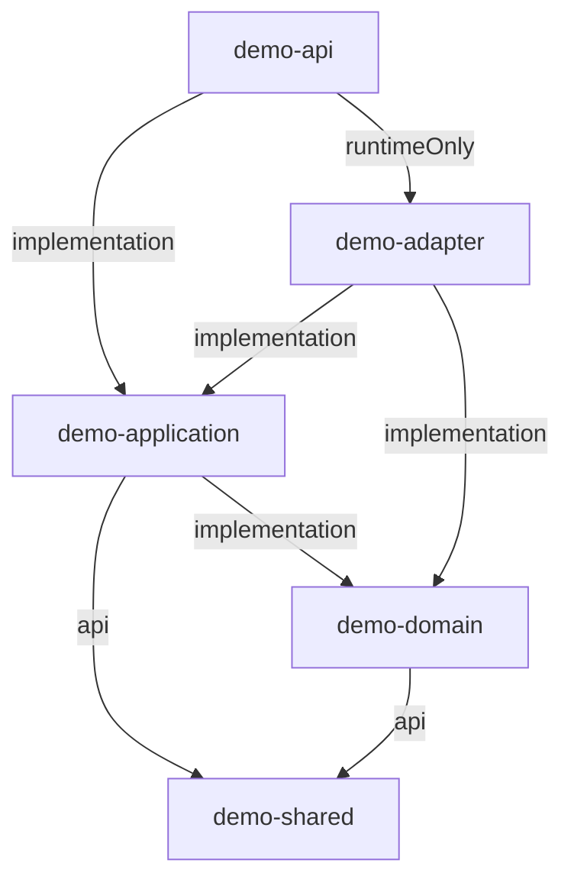

# 소개
마이크로서비스의 모듈 구성 예제입니다.

# 모듈 설명
## demo-api
- API 계층으로, 외부 클라이언트와의 통신을 처리합니다. 주로 Controller 및 요청/응답 DTO를 포함합니다.
- spring framework에 의존합니다.
- runtimeOnly로 demo-adapter를 의존하기 때문에 소스코드에서는 demo-adapter에 의존성이 없습니다.

## demo-application
- 비즈니스 로직과 도메인 로직을 조율하며, 주로 서비스 계층과 유스케이스를 담당합니다.
- spring framework에 의존합니다.
- rdbms, redis, kafka와 같은 세부적인 기술에는 의존하지 않고 인터페이스를 정의해 사용합니다.

## demo-adapter
- 세부적인 기술을 사용해 demo-application에서 정의한 인터페이스를 구현합니다.
- 기술을 변경해야 해도 새로운 adapter 모듈을 만들어 이 모듈을 교체하지 않기로 합니다.
  - 기술에 대한 구현체를 sub adapter 모듈로 개발하고, demo-adapter에서 sub adapter를 선택하도록 합니다.
  - 혹은 demo-adapter에서 구현체를 추가하고 최종적으로 사용할 구현체를 bean으로 등록합니다.

## demo-domain
- 핵심 도메인 모델과 비즈니스 로직을 포함하며, 다른 계층에 의존하지 않고 독립적으로 동작합니다.
- spring framework에 의존하지 않습니다.

## demo-shared
- 여러 모듈에서 공통적으로 사용되는 Type, 유틸리티 클래스 또는 상수 등을 포함합니다.

